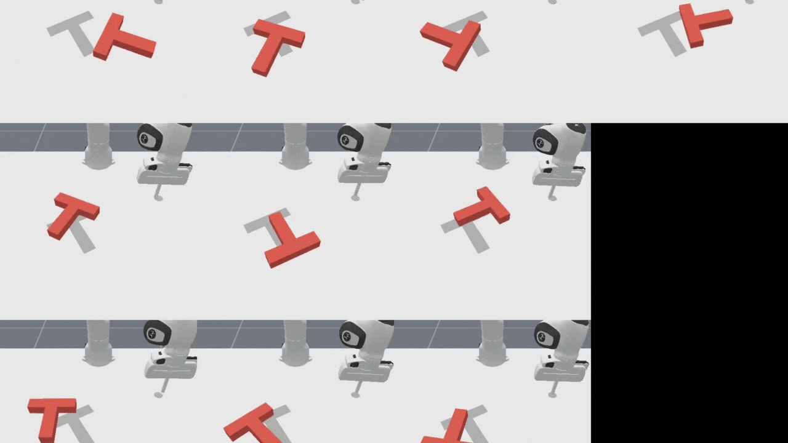

# ManiSkill Diffusion Policy: Push-T Experiments


This repository contains the notebooks for training, evaluating, and steering **visual-based diffusion policies** on the **Push-T** robotic manipulation task using the **ManiSkill** environment.

---

## Reproduce Results

1. Download the contents of this repository.
2. Create a folder in Google Drive called diffusionpolicy.
3. Upload the contents of this repository into that folder.

---

## Directory Structure

```
maniskill-diffusion/
├── diffusion_policy/                # Core diffusion policy implementation
│   ├── evaluate.py                  # Evaluation functions
│   ├── make_env.py                  # Environment creation utilities
│   └── ...                          # Models, agents, and utilities
├── runs/                            # Logs and checkpoints
├── wandb/                           # Weights & Biases experiment logs
├── baselines.sh                     # Script for running baselines
├── *.ipynb                          # Notebooks for demos and evaluation
├── setup.py                         # Project installation script
└── README.md                        # This file
```

---

## Demo Video



---

## Setup Instructions

### 1. Install Dependencies
- **Python** 3.8+ recommended
- Install ManiSkill and other packages:

```bash
pip install -e .
pip install mani_skill tyro diffusers tensorboard wandb
```

> **Tip:** Make sure ManiSkill is set up with the `physx_cuda` simulator for best performance.

---

### 2. Download Demonstrations
Download Push-T demonstrations using ManiSkill's utilities:

```bash
python -m mani_skill.utils.download_demo PushT-v1
```

---

## Running Experiments

### State-Based Diffusion Policy

#### Training
```bash
python train.py --env-id PushT-v1 \
  --demo-path /path/to/trajectory.state.pd_ee_delta_pose.physx_cuda.h5 \
  --control-mode pd_ee_delta_pose --sim-backend physx_cuda \
  --num-demos 600 --max_episode_steps 100 \
  --total_iters 30000 --exp-name diffusion_policy-PushT-v1-state
```

#### Example Notebook
See [`pusht_state.ipynb`](pusht_state.ipynb) for training and evaluation walkthrough.

---

### Visual-Based Diffusion Policy

#### Training
```bash
python train_rgbd.py --env-id PushT-v1 \
  --demo-path /path/to/trajectory.rgbd.pd_ee_delta_pos.physx_cuda.h5 \
  --control-mode pd_ee_delta_pos --sim-backend physx_cuda \
  --num-demos 600 --max_episode_steps 100 \
  --total_iters 30000 --exp-name diffusion_policy-PushT-v1-rgbd
```

#### Example Notebook
See:
- [`pusht_rgbd_demo.ipynb`](pusht_rgbd_demo.ipynb) for visual policy examples.
- [`train_rgbd.py`](train_rgbd.py) and [`train_rgbd_2b.py`](train_rgbd_2b.py) for training the diffusion policy.

### Evaluation on Hard Configurations

Evaluate policies on harder task setups using:

```python
from diffusion_policy.evaluate import evaluate

metrics = evaluate(
    n=250,
    agent=agent,
    eval_envs=envs,
    device=agent.device,
    sim_backend=args.sim_backend,
    progress_bar=True
)
```

> For an example, see [`pusht_rgbd_eval_hard_config.ipynb`](pusht_rgbd_eval_hard_config.ipynb).

---

### Steering Techniques

**Trajectory Steering:**
- At inference, sample multiple trajectories.
- Score trajectories based on smoothness, directionality, or task-specific metrics.
- Execute the highest scoring action sequence.

See:
- [`pusht_rgbd_demo_steering.ipynb`](pusht_rgbd_demo_steering.ipynb)
- [`train_rgbd_steering.py`](train_rgbd_steering.py)

**Note:**  
Simple scoring functions did not align well with true task goals. Future directions could include value-guided or human-in-the-loop steering methods.

---

## Analysis and Results

- **State-Based Policies:**  
  Training is stable, but task success rates remain low despite rapid loss decrease.

- **Visual-Based Policies:**  
  Policies display multimodal behavior but struggle to complete the task. Extending the prediction/action horizon yields diminishing returns.

- **Steering Attempts:**  
  FK-style steering (sampling + scoring) does not significantly improve success, likely due to challenges in scoring and visuomotor mapping.

---

## References

- [ManiSkill Repository](https://github.com/haosulab/ManiSkill)
- [Diffusion Policy (Xie et al., 2023)](https://arxiv.org/pdf/2303.04137)